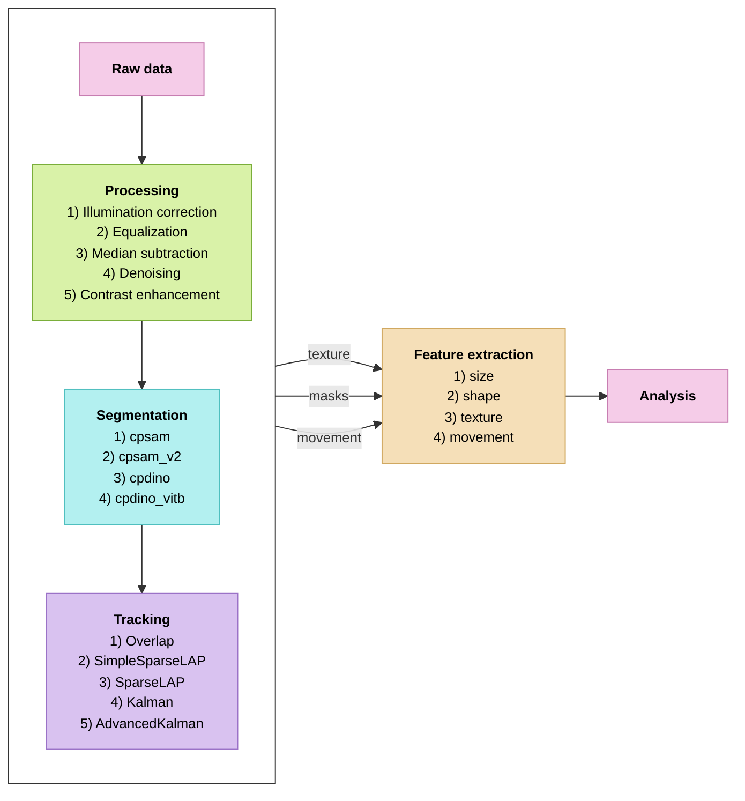

# ACID - pipeline

A pipeline for DIC timelapse microscopy data of cell experiments. It
takes the raw microscopy data and carries it through four stages —
**processing → segmentation → tracking → feature extraction**.

## The four stages

### 1. Processing
Cleans the raw DIC frames so they can be segmented and compared. Per-frame
shadow correction removes uneven illumination, equalization matches every frame
to a shared intensity reference (so cells are comparable across the whole
dataset), and median subtraction removes fixed background dirt. Optional
denoising and contrast steps can be added. Output filenames record exactly which
steps and parameters were applied.

### 2. Segmentation
Finds the cells in every frame. Several Cellpose version 4.2.1.1 models can be compared
side-by-side first, then the chosen model is run over the whole timelapse to
produce a mask for each cell in each frame.

### 3. Tracking
Links the masks across frames so each cell keeps a consistent identity over
time (TrackMate using CellPhe). The result is a trajectory per cell where it is, frame by
frame plus its outline (ROI) at every timepoint.

### 4. Feature extraction
Measures each tracked cell at every frame (CellPhe): shape, texture and movement
features. The output is one row per cell per frame, a time series of
measurements for every cell that can then be plotted and analysed.

## Running code

| File | Stage | What it does | Conda environment
|---|---|---|---|
| `processing` | 1 | Preprocessing: shadow correction, equalization, median subtraction, denoising, contract enhancement | processing |
| `segmentation_tracking_features` | 2-4 | Segment, track and extract features in one workflow | cellphepy |

Two conda environments are used, because Cellpose / CellPhe / Java versions don't coexist cleanly.

## Detailed documentation

Each stage has its own document with a full description of what the code does:

| Stage | Detailed description |
|---|---|
| 1. Processing | [`processing.md`](processing.md) |
| 2-4. Segmentation, tracking & feature extraction | [`segmentation_tracking_features.md`](segmentation_tracking_features.md) |

See those files for the details of each stage.
