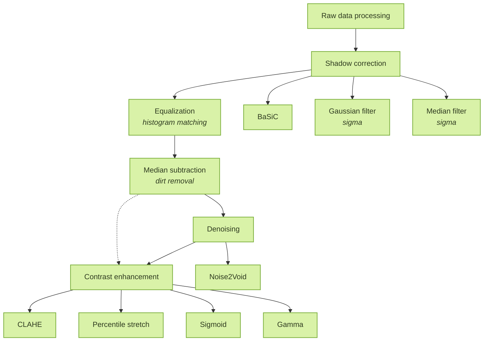

# Processing

[← Back to pipeline overview](README.md)

Processing pipeline for DIC timelapse data. Takes raw ND2 files and produces
cleaned, comparable image stacks ready for segmentation, tracking and features extraction.

The pipeline runs five optional steps in order:

```
shadow (illumination) correction → equalization → median subtraction → denoising → contrast enhancement
```

Every step can be switched on or off and the output filename records which
steps were applied, so any file can be traced back to the settings that made it.

Graph has to be fixed!


Each step has its own selectable method(s), shown branching below it. The dashed
arrow marks that contrast enhancement can follow median subtraction directly when
denoising is off.

## What each step does

| Step | Function | Methods | Purpose |
|------|----------|---------|---------|
| **Shadow correction** | `shadow_correction` | Gaussian filter, Median filter, BaSiC | Removes uneven illumination. The Gaussian and median methods work per frame; BaSiC fits one flatfield across the stack. |
| **Equalization** | `equalize_intensity` | histogram matching | Matches every frame to a reference, so intensity is comparable across time — and optionally across positions. |
| **Median subtraction** | `median_subtract` | dirt removal | Subtracts the temporal-median background to remove static dirt and debris. |
| **Denoising** | `denoise_n2v` | Noise2Void | Self-supervised denoising. Noise2Void via CAREamics (GPU). |
| **Contrast enhancement** | `enhance_contrast` | CLAHE, Percentile stretch, Sigmoid, Gamma | Improves visibility of low-contrast DIC. |

Each step reads the output of the one before it. With `SAVE_INTERMEDIATES = True`
the stack is written to disk after every enabled step, so you can inspect the
effect of each one on its own and pick up from any point.

### Naming logic
 
The filename is **built up cumulatively as the pipeline runs**. It starts with
the experiment and position, and each enabled step appends its own tag. Disabled
steps add nothing, so the final name is an exact, ordered record of which steps
ran and with what settings — two different settings can never produce the same
name, and any file can be read back to the pipeline that made it.
 
The name is assembled in this fixed order:
 
```
<experiment>_pos<NN>[_<shadow>][_eq<...>][_med<offset>][_n2v<...>][_ce_<...>].tif
```
 
**The starting point** (always present):
 
| Fragment | Meaning |
|----------|---------|
| `<experiment>` | experiment name — the parent folder of the source ND2 |
| `pos<NN>` | position, 1-indexed and zero-padded (`pos07`, `pos15`) |
 
**Each step's tag** (appended only if the step is enabled):
 
| Step | Tag format | Example |
|------|-----------|---------|
| Shadow correction | `sc_<method><sigma>`, or `sc_basic` for BaSiC | `sc_gaussian8`, `sc_median8`, `sc_basic` |
| Equalization — `saved` | `eq(<reference-file-name>)` | `eq(A07.3_avg41pos_x81t_sc_gaussian8)` |
| Equalization — `frame` | `eq(<exp>_pos<NN>_t<frame>)` | `eq(A07.3_pos06_t40)` |
| Equalization — `local` | `eq<frame>` | `eq40` |
| Median subtraction | `med<offset>` | `med1300`, `med2446` |
| Denoising | `n2v_<epochs>_<patch>_<batch>` | `n2v_100_64_16` |
| Contrast — CLAHE | `ce_clahe<clip>` | `ce_clahe0.01` |
| Contrast — gamma | `ce_gamma<value>` | `ce_gamma0.7` |
| Contrast — percentile | `ce_pct<low>-<high>` | `ce_pct1.0-99.0` |
| Contrast — sigmoid | `ce_sig<cutoff>g<gain>` | `ce_sig0.5g10` |
 
The three equalization modes deserve a note, because their tags differ by design:
 
- **`saved`** matches every frame to a pre-built reference image on disk. The tag
  embeds *that reference's own filename* (minus the `ref_` prefix), so the output
  records exactly what it was matched to — and because every position in every
  run uses the same saved reference, they all carry the identical `eq(...)` tag
  and are directly comparable.
- **`frame`** matches to one frame of a reference position, rebuilt each run; the
  tag records the experiment, position and frame of that reference.
- **`local`** matches each stack to a frame within itself; the tag records only
  the frame index.
#### Worked examples
 
**Example 1 — shadow + saved-equalization + median** (a typical run for
segmentation, with denoising and contrast off):
 
```
A09.1_pos20_sc_gaussian8_eq(A07.3_avg41pos_x81t_sc_gaussian8)_med2420.tif
```
 
| Fragment | Step | Reads as |
|----------|------|----------|
| `A09.1` | start | experiment A09.1 |
| `pos20` | start | position 20 |
| `sc_gaussian8` | shadow | Gaussian shading correction, σ = 8 |
| `eq(A07.3_avg41pos_x81t_sc_gaussian8)` | equalization | saved reference: the A07.3 average over 41 positions × 81 frames, itself shadow-corrected with gaussian σ8 |
| `med2420` | median | median subtraction, offset 2420 |
 
**Example 2 — the minimal run** (only shadow and median enabled, everything
else off):
 
```
A07.3_pos15_sc_gaussian8_med1300.tif
```
 
The `eq(...)`, `n2v` and `ce_` fragments are simply absent, which tells you at a
glance that equalization, denoising and contrast were all off for this file.
 
**Example 3 — the full chain** (every step enabled, local equalization,
percentile contrast):
 
```
A07.3_pos15_sc_gaussian8_eq40_med1300_n2v_100_64_16_ce_pct1.0-99.0.tif
```
 
Reading left to right: experiment A07.3, position 15, Gaussian shading (σ8), equalized to
frame 40 of its own stack, median offset 1300, Noise2Void (100 epochs, 64-px
patches, batch 16), then a 1–99 percentile stretch.

## How to run
 
### 1. Set up the environment
 
`processing.py` runs in the **processing** conda environment.
 
```bash
conda activate processing
```
 
### 2. Edit the SETTINGS block
 
Open `processing.py` and edit the **SETTINGS** block at the top:
 
- **`FILES_AND_POSITIONS`** — which ND2 files and which positions to process.
- **Which steps to run** — `DO_SHADING`, `DO_EQUALIZE`, `DO_MEDIAN`,
  `DO_DENOISE`, `DO_CONTRAST`.
- **Step parameters** — e.g. `BG_SIGMA`, `EQUALIZE_MODE` / `EQUALIZE_REF_PATH`,
  `CONTRAST_METHOD`.
- **`OUTPUT_DIR`** — where results go (default `processed_positions/`).
- **`SAVE_INTERMEDIATES`** — `True` to save after every step, `False` for the
  final stack only.
### 3. Run
 
```bash
python processing.py
```
 
The script prints its progress as it goes — one block per experiment, then each
position and the steps applied to it:
 
```
=== A07.3 ===
  loading...
  shape (81, 42, 1024, 1024)
  position 15:
    - shadow correction (gaussian, sigma=8)
    - equalization (saved)
    - median subtraction (offset=auto)
    saved: processed_positions/A07.3/A07.3_pos15_sc_gaussian8_eq(...)_med2446.tif
```
 
When it finishes it prints `Done.`, and the processed stacks are in
`OUTPUT_DIR`.

 ### (optional) Build a saved equalization reference (once)
 
If you use `EQUALIZE_MODE = "saved"` (recommended), build the reference image
first — this only has to be done once per dataset:
 
```bash
python build_equalization_reference.py
```
 
It prints the reference path to paste into `EQUALIZE_REF_PATH`. Skip this step
if you use `"frame"` or `"local"` equalization, or if equalization is off.

## Output
 
### Where do files go?
 
Every output is written under `OUTPUT_DIR`, inside a subfolder named after the
**experiment** — the name of the folder the source ND2 file sits in. The path
logic (`save_stack`) is:
 
```
OUTPUT_DIR / <experiment> / <experiment>_<tags>.tif
```
 
- **`OUTPUT_DIR`** — set in the settings block (default `..\output`, i.e. an
  `output/` folder one level above the script).
- **`<experiment>`** — derived automatically as the parent folder of the ND2
  file. So `.../ACID/250729/A07.3/H7_DENV2_MOI1_40h.nd2` writes into `A07.3/`.
- The experiment subfolder is created automatically if it doesn't exist.
All positions from the same experiment land in the **same** experiment folder,
distinguished by the `pos` tag in their filename. A run over several ND2 files
produces one subfolder per experiment:
 
```
output/
├── A07.3/
│   ├── A07.3_pos15_sc_gaussian8_eq(A07.3_avg41pos_x81t_sc_gaussian8)_med2446.tif
│   ├── A07.3_pos24_sc_gaussian8_eq(A07.3_avg41pos_x81t_sc_gaussian8)_med2459.tif
│   └── ...
└── A04.2/
    ├── A04.2_pos10_sc_gaussian8_eq(A07.3_avg41pos_x81t_sc_gaussian8)_med2597.tif
    └── ...
```
 
### Intermediates
 
`SAVE_INTERMEDIATES` controls how many files each position produces:
 
- **`SAVE_INTERMEDIATES = True`** — the stack is saved **after every enabled
  step**, each under its cumulative name. Because the name grows as steps are
  applied, the files for one position share a growing prefix — you can see the
  effect of each step on its own, and pick up from any point:
```
  A07.3_pos15_sc_gaussian8.tif                                   (after shadow)
  A07.3_pos15_sc_gaussian8_eq(A07.3_avg41pos_x81t_sc_gaussian8).tif   (+ equalization)
  A07.3_pos15_sc_gaussian8_eq(...)_med2446.tif                   (+ median)
```
 
- **`SAVE_INTERMEDIATES = False`** — only the **final** fully-processed stack is
  written, one file per position. When intermediates are on, the last step's
  save already is the final file, so no duplicate is written.
Either way the filename is a full record of what was done — see
Naming logic.
 
## Notes

- Output stacks are `float32` TIFF with ImageJ axis metadata (`TYX`), so they
  open directly in FIJI as timelapses.
- `MEDIAN_OFFSET = "auto"` keeps the darkest pixel of the median image at 1,
  subtracting as much background as possible while staying positive.


## Limitations and possible improvements

- **Axis order is assumed, not checked.** The loader assumes ND2 files are
  `(T, P, Y, X)`. Files acquired with different settings could
  have a different order, which silently slices the wrong axis. Reading
  `ND2File(path).sizes` and adapting to it would make the loader robust.

- **No non-local-means denoising.** Only Noise2Void is implemented, though a
  classical non-local-means option (via `skimage.restoration`) would be a fast
  GPU-free alternative that needs no training.

- **Difference of Gaussians is not included as a shading method** Currently
  Gaussian filter is used but having difference of Gaussians implemented
  would be even more useful. 
