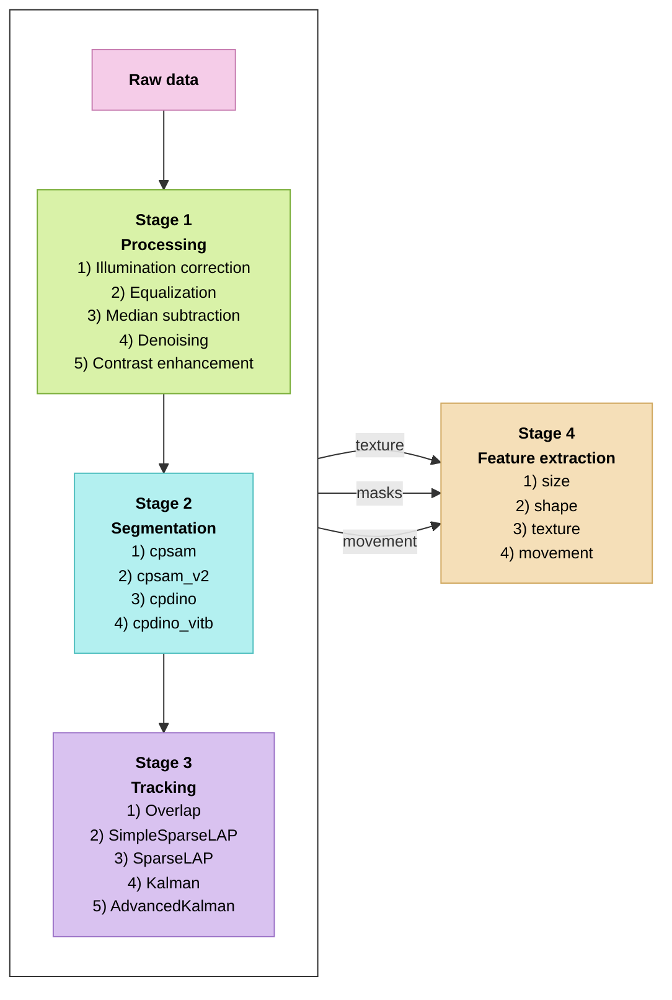

# Segmentation, tracking and feature extraction

[← Back to pipeline overview](README.md)

Covers stages 2–4 of the pipeline. Takes the preprocessed timelapse stacks (the
output of `processing.py`) and runs, for each file in `INPUT_FILES`:

```
Cellpose segmentation  →  TrackMate tracking  →  CellPhe features
```

Every file gets its own output folder named after the file, so results are
traceable back to exactly which processed stack — and which model and tracker —
produced them.



## The three steps

| Step | Tool | What it does |
|------|------|--------------|
| **Segmentation** | Cellpose | Finds the cells in each frame, writing one mask per frame. |
| **Tracking** | TrackMate (via CellPhe) | Links masks across frames so each cell keeps a consistent identity, producing a tracking table and an ROI archive. |
| **Feature extraction** | CellPhe | Computes the 74 per-frame features (shape, texture, movement) for every tracked cell. |

Each step reads its input from disk, so the three can be run independently
(`DO_SEGMENT` / `DO_TRACK` / `DO_FEATURES`) — you can segment once, then re-run
only tracking or only features without repeating the slow segmentation.

## How to run

1. Activate the environment: `conda activate cellphepy`
2. Make sure `JAVA_HOME` is set (only needed if `DO_TRACK = True`).
3. Edit the **SETTINGS** block at the top of the script (see below).
4. Run:

```bash
python segmentation_tracking_features.py
```

The script processes each file in turn, printing progress, and finishes with a
summary of how many succeeded. One bad file doesn't stop the batch — it's
recorded and the rest continue.

## Configuration

### Input files

`INPUT_FILES` is a list of preprocessed stacks — each is one position, `(T, Y, X)`.
They are processed one after another:

```python
INPUT_FILES = [
    r"...\A07.3_pos11_..._med2389.tif",
    r"...\A07.3_pos34_..._med2439.tif",
]
```

### Output location

```python
OUTPUT_DIR = r"..\output\segmentation_output"
```

### Which steps to run

```python
DO_SEGMENT  = True
DO_TRACK    = True
DO_FEATURES = True
```

Because each step reads from disk, you can toggle them to rerun only part of the
pipeline — e.g. `DO_SEGMENT = False` to reuse existing masks and only re-track
or re-extract features. (With `DO_SEGMENT = False` the script expects the output
folder for that file and model to already exist, and stops with a clear message
if it doesn't.)

### Segmentation (Cellpose)

| Parameter | Meaning |
|-----------|---------|
| `CP_MODEL` | Which model (`cpsam`, `cpsam_v2`, `cpdino`, `cpdino-vitb`). |
| `CP_GPU` | Use the GPU. |
| `CP_DIAMETER` | Expected cell size in px; `None` = auto-estimate. |
| `CP_FLOW_THRESHOLD` | Higher separates touching cells better. |
| `CP_CELLPROB_THRESHOLD` | Lower finds more / fainter cells. |
| `CP_MIN_SIZE` | Smallest object (px) that counts as a cell. |
| `CP_NORMALIZE` | Percentile-stretch the input before segmenting (keep `True`). |
| `SEGMENT_FRAMES` | `"all"`, `"last"`, or a list like `[0, 40, 79]`. |

### Tracking (TrackMate using CellPhe)

```python
TRACKER   = "Overlap"   # SimpleSparseLAP, SparseLAP, Kalman, AdvancedKalman, Overlap
MINFRAMES = 30          # keep only cells tracked for at least this many frames
```

`Overlap` works well for adherent cells that don't move far between frames.

### Feature extraction (CellPhe)

```python
FRAMERATE = 1           # 1 = scaleless velocity units
```

`cell_features` computes all 74 features for every tracked cell that passes the
`MINFRAMES` filter — select the columns you want afterwards.

## Output

Each input file gets its own folder under `OUTPUT_DIR`, grouped by **experiment**
(the leading `A07.3` / `A02.1` part of the name) and named
`<file-stem>_<model>`:

```
output/segmentation_output/
└── A07.3/
    └── A07.3_pos11_..._med2389_cpsam_v2/
        ├── frames/                          exp-0001.tif …          (1-indexed)
        ├── masks/                           frame_000_mask.tif …    (0-indexed)
        ├── segmentation_parameters.txt      the settings used for this run
        ├── A07.3_pos11_..._tracked_Overlap.csv        tracking table
        ├── A07.3_pos11_..._rois_Overlap.zip           ImageJ/Fiji ROIs
        └── A07.3_pos11_..._features_Overlap_min30.csv per-cell, per-frame features
```

- **`frames/`** — the DIC frames exported for CellPhe, `exp-0001.tif` upward
  (1-indexed, the TrackMate convention).
- **`masks/`** — one Cellpose mask per frame, `frame_000_mask.tif` (0-indexed).
- **`segmentation_parameters.txt`** — a record of the model, thresholds, tracker
  and minframes used, so the run is reproducible.
- The tracking CSV, ROI zip and feature CSV carry the tracker (and, for features,
  the minframes) in their names.

Positions from the same experiment are grouped under one experiment folder.
When `DO_SEGMENT` is on, a fresh folder is created and never overwritten — if one
already exists it appends `_2`, `_3`, … When `DO_SEGMENT` is off, the script
reuses the existing folder for that file and model.

## Notes

- **`.copy()` on each frame before segmentation** — with `normalize=True`
  Cellpose rescales its input in place; since a stack slice is a view, that would
  corrupt the frame being saved. Passing a copy keeps the saved frame clean.
- **Frames are 1-indexed on disk** (`exp-0001.tif`) to match CellPhe; **masks are
  0-indexed** (`frame_000_mask.tif`).
- **Duplicate cell-frame rows** are dropped as a safety net before features are
  saved (`drop_duplicates` on `["FrameID", "CellID"]`).
- The script prints a short **tracking report** (unique IDs, median frames per
  ID, how many cells last ≥10/30/60 frames) so you can see how well tracking held
  identity before trusting the features.
